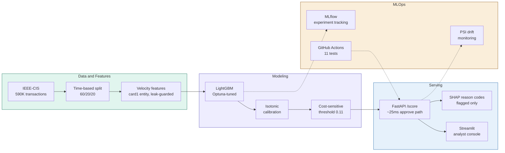

# Real-Time Card Fraud Detection


An end-to-end fraud detection **system** — not a notebook. A calibrated LightGBM model on 590K real transactions, served behind a FastAPI endpoint with SHAP reason codes, an analyst review dashboard, drift monitoring, and CI. The whole stack runs with one command.

> **Framing:** You are the data scientist at a payment processor. The fraud team can review **200 alerts per day**. Your job is to build the system that decides which 200 of millions of transactions reach them — and to prove it keeps working after deployment.

---

## Architecture



---

## Results (held-out test set)

Evaluated once on the final 20% of the timeline (118K transactions, ~42 days, never touched during training, tuning, calibration, or threshold selection). Metrics reported with 95% bootstrap confidence intervals.

| Metric | Value | 95% CI |
|---|---|---|
| ROC-AUC | 0.886 | [0.880, 0.892] |
| PR-AUC | 0.483 | [0.468, 0.498] |
| Precision@200 | 0.980 | [0.950, 0.995] |
| Brier score | 0.023 | — |

**At the cost-optimized operating threshold (0.11 on calibrated probability):**

- **59% of fraud caught** while flagging **185 transactions/day** (92% of the 200-alert capacity)
- **96–98% precision** on the top-200 highest-scoring transactions
- **~$7,700/day net savings** (≈ **$2.8M/year**) at $172 average fraud amount and $5 analyst review cost
- Adjusted for realistic 60–80% fraud recovery: **≈ $1.7M–$2.2M/year**

Test performance sits below validation (PR-AUC 0.48 vs 0.62) — a deliberate, honest result explained under [The drift story](#the-drift-story-and-a-bug-it-caught).

---

## The drift story (and a bug it caught)

Drift monitoring did what it is supposed to do: it caught a real feature-engineering bug that leakage tests had missed.

**What happened.** Post-training PSI monitoring flagged two engineered velocity features — `device_distinct_cards_24h` and `email_distinct_cards_24h` — with PSI ≈ 1.8 (anything above 0.25 is "major drift"). Every other feature was stable (PSI < 0.06).

**Root cause.** These features grouped velocity on `DeviceInfo` and `P_emaildomain`, which are **coarse categories, not entities**. `DeviceInfo = "Windows"` covers thousands of transactions; `P_emaildomain = "gmail.com"` covers millions of users. So "distinct cards per device in 24h" was really "distinct cards per platform" — hundreds per day, growing over time as traffic accumulated. IEEE-CIS has no true device or user ID, so genuine per-entity velocity on those keys is impossible.

**Fix and result.** I removed the coarse features and kept the bounded, sane `card1`-based velocity (transactions per card over 24h/7d, time since last). After retraining:

| | Before fix | After fix |
|---|---|---|
| Test PR-AUC | 0.461 | **0.483** |
| Test Precision@200 | 0.960 | **0.980** |
| Max feature PSI | 1.88 | **0.057** |

Removing the broken features **improved** the model — they were adding noise, not signal.

**The deeper finding.** With every feature distribution now stable (PSI < 0.06) and prediction drift negligible (0.046), yet test PR-AUC still below validation, the val→test gap is isolated as **concept drift** — the feature→fraud relationship changing over time — rather than **covariate drift** (inputs shifting). This is *why* fraud models decay and require retraining, and why feature-drift monitoring alone is insufficient: label-based performance monitoring is essential.

---

## Key technical decisions

**Time-based validation, never random.** Fraud rate is non-stationary (it roughly doubles ~25 days into the timeline). Random K-fold would leak future distribution into training and inflate metrics. All splits and cross-validation are chronological; walk-forward CV reports PR-AUC 0.64 ± 0.05 across 5 folds.

**No rebalancing.** A controlled experiment compared four strategies (baseline, `scale_pos_weight`, undersampling, SMOTE) on identical walk-forward folds. **Baseline (no rebalancing) won on both PR-AUC and stability** — LightGBM handles imbalance through pure-region tree splits, and rank-based metrics don't reward the calibrated probabilities rebalancing would provide. SMOTE's synthetic minority samples in high-dimensional sparse fraud data don't reflect real fraud.

**Rank-based early stopping.** An early failure mode: `scale_pos_weight` + `binary_logloss` early stopping trained a single tree before diverging. Switching the eval metric to average precision (PR-AUC) fixed it and lifted the model from a one-tree stub to 355 trees. Class weights and log-loss early stopping don't mix — you need a rank-based stopping metric.

**Calibrated probabilities.** Isotonic regression on validation makes a score of 0.8 mean roughly 80% fraud probability — required for the cost-sensitive threshold to be meaningful. (The model came out reasonably calibrated already, since no rebalancing was applied.)

**Cost-sensitive threshold under a capacity constraint.** The operating point maximizes expected net savings *subject to* ≤ 200 alerts/day. Without the constraint the theoretical optimum floods analysts with thousands of alerts; the constraint is what makes the number real.

---

## Explainability and fairness

**Per-transaction reason codes.** Every flagged transaction returns the top-3 features driving its score, translated to plain English ("Transaction amount is $300", "Card type: credit"). Anonymized Vesta features are honestly labeled as internal signals rather than given invented meaning. Reason codes are computed only for flagged transactions (the only ones an analyst reviews), using LightGBM's native `pred_contrib` — keeping the approve path at ~25ms with no latency cliff during attack bursts.

**Fairness screening.** False-positive rates were normalized by actual fraud rate across billing-region and email-domain proxies. Most groups are flagged in proportion to their risk; a handful of small, low-fraud regions are over-flagged 3–6×, consistent with data sparsity rather than systematic bias. The highest-risk group (missing billing address) is *under*-flagged relative to its risk. As IEEE-CIS lacks true protected attributes, this is a screening audit, not a certification.

---

## Running it

```bash
# clone and bring up the API in Docker
git clone https://github.com/Yasser-Bousalem/fraud-detection.git
cd fraud-detection
docker compose up
```

The scoring API is then live:

```bash
curl -X POST http://localhost:8000/score \
  -H "Content-Type: application/json" \
  -d '{"TransactionAmt": 300.0, "ProductCD": "C", "card1": 13926,
       "card4": "visa", "card6": "credit", "P_emaildomain": "gmail.com",
       "DeviceType": "mobile", "DeviceInfo": "iOS Device"}'
```

```json
{
  "fraud_score": 0.42,
  "decision": "review",
  "threshold": 0.1113,
  "reason_codes": [
    {"feature": "TransactionAmt", "explanation": "Transaction amount is $300", "shap_impact": 1.27},
    {"feature": "card6", "explanation": "Card type: credit", "shap_impact": 0.29}
  ],
  "model_version": "1.0.0"
}
```

- Interactive API docs: `http://localhost:8000/docs`
- Analyst console: `streamlit run dashboard/app.py`
- Experiment tracking: `mlflow ui --backend-store-uri sqlite:///mlflow.db`

### Reproducing training

Training needs the [IEEE-CIS dataset](https://www.kaggle.com/c/ieee-fraud-detection) (`data/raw/`), then:

```bash
python -m src.models.calibrate     # train champion + calibrate
python -m src.models.threshold     # cost-sensitive operating point
python -m src.models.final_eval    # honest test-set evaluation
python -m src.monitoring.drift     # PSI drift report
```

---

## Stack

| Layer | Tools |
|---|---|
| Modeling | LightGBM, Optuna, scikit-learn (isotonic calibration) |
| Explainability | SHAP (`TreeExplainer` + native `pred_contrib`) |
| Serving | FastAPI, uvicorn, Docker |
| Dashboard | Streamlit |
| Tracking & monitoring | MLflow, PSI-based drift detection |
| Testing & CI | pytest, ruff, GitHub Actions |

---

## Project layout

```
├── src/
│   ├── data/            # load + time-based splits
│   ├── features/        # velocity feature engineering
│   ├── models/          # train, tune, calibrate, threshold, evaluate
│   ├── explainability/  # global SHAP, reason codes, fairness audit
│   └── monitoring/      # PSI drift detection
├── api/                 # FastAPI scoring service
├── dashboard/           # Streamlit analyst console
├── tests/               # 11 tests, run in CI
├── Dockerfile.api
├── docker-compose.yml
└── .github/workflows/   # CI
```

---

## Limitations and future work

- **Concept drift is real and unaddressed at runtime.** Production would need scheduled retraining plus label-based performance monitoring, not just feature drift.
- **No true entity key.** IEEE-CIS anonymization prevents genuine per-device/per-user velocity. UID reconstruction (clustering `card1 + addr1 + D-features`, as Kaggle winners did) is the highest-value next feature-engineering step.
- **Serving loads flat model files, not an MLflow registry.** A registry-backed serving layer with automated retraining orchestration is demonstrated in a companion project (real-time 5G intrusion detection); this project intentionally keeps serving self-contained.
- **Benchmark vs production framing.** This model was built for deployment characteristics — honest evaluation, calibration, low latency, explainability, drift resistance — not leaderboard maximization. Leaderboard-winning IEEE-CIS solutions reach ROC-AUC ~0.94 via private-test tuning and 10-model ensembles that are impractical to operate.

---

*Built as a self-directed project to practice production-grade, deployable data science — the parts that live beyond the notebook.*